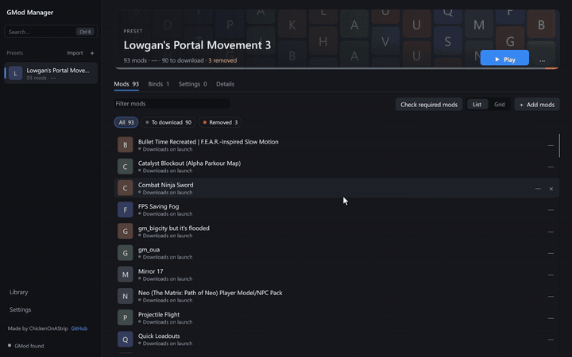

# GMod Manager

Switch between Garry's Mod presets without setting everything up again.

## Install

1. Download `GModManager-Windows.zip` from the [latest release](https://github.com/ChickenStrxps/gmod-manager/releases/latest).
2. Unzip it anywhere and run `gmod-manager.exe`.

Steam and Garry's Mod must be installed.

## Use

Choose a preset or import a Steam Workshop collection, then click **Play**. If GMod is still downloading mods, wait at its main menu until **Addons → GMod Manager** no longer shows "not ready." Restart the map if you joined before the downloads finished.

- Search the Workshop for mods and add them to a preset. Switch between list and grid views.
- Click **Check required mods** to find dependencies. If Steam queries don't work, choose **Workshop pages (fallback)** in Settings.
- Turn on **Library** to keep compressed copies of mods for other presets. **Optimize stored mods** can shrink older copies without changing their contents.
- Add binds and console settings to a preset. Share it as a ZIP file, or import one from ZIP or JSON.
- Use **Undo last apply** from the preset menu to restore files the app changed.
- Check for updates in **Settings**.
